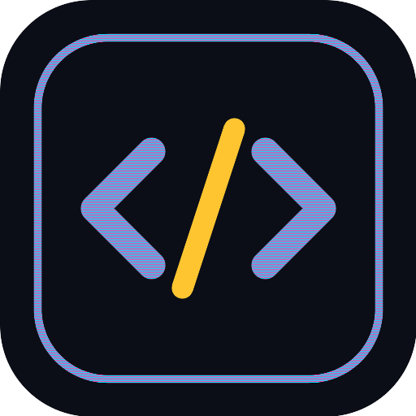

# 🎮 CODE ARCADE

Six coding mini-games in one web app, served from **Termux** on your phone.
No internet, no npm, no pip — just Python's standard library.

<p align="center">
  
</p>

---

## Quick start (Termux)

```bash
pkg install python          # only needed once
cd codearcade
python server.py
```

Then open **http://localhost:8080** in Chrome/Firefox on the same phone.

Or use the launcher (also tries to open the browser for you):

```bash
chmod +x run.sh
./run.sh                    # ./run.sh 5000 for a different port
```

**Play it like a real app:** in Chrome tap ⋮ → *Add to Home Screen*.
It installs as a PWA, runs full-screen, and works with Wi-Fi and data off.

> The terminal also prints a `http://192.168.x.x:8080` address — open that on a
> laptop or a friend's phone on the same Wi-Fi to play there too.

---

## The games

| Game | What you do | What it teaches |
|---|---|---|
| 🐞 **Bug Hunter** | Tap the line hiding the bug before the timer dies | Off-by-one, `=` vs `==`, mutable defaults, scope, dangling pointers |
| 🔮 **Output Oracle** | Predict exactly what a snippet prints | Type coercion, integer division, float precision, operator order |
| 🧩 **Stack Rebuild** | Reorder scrambled lines (indentation counts) | Program structure: FizzBuzz → binary search → quicksort partition |
| 🔢 **Binary Blaster** | Flip 8 bits to hit the target before the fuse burns | Binary/hex conversion and bitwise `AND` `OR` `XOR` |
| 🎯 **Regex Ranger** | Write a pattern matching green strings, not red | Regex, live-highlighted, with a token keypad so you don't fight the keyboard |
| ⌨️ **Terminal Typer** | Type real code lines at speed | Symbol-heavy typing speed and accuracy |

---

## Things that keep it interesting

- **XP + levels** — every correct answer levels you up; level-ups pay coins and power-ups.
- **Combos** — consecutive correct answers multiply your score (capped at ×8).
- **Boss rounds** — every 10th question is worth **3×** on a tighter clock.
- **Coins & Shop** — buy power-ups, unlock **5 themes** (Neon, Matrix, Synthwave, Amber CRT, Paper).
- **24 badges** — from *First Blood* to *Regex Golfer* and *Keyboard Ninja*.
- **Daily Gauntlet** — all six games chained into one run. Same puzzles for everyone
  that day (date-seeded), and clearing all six builds your 🔥 **streak**.
- **Power-ups** — 50/50, Freeze (+time), Hint, Skip.
- **Syllabus filter** — restrict content to Python / JavaScript / C / Java.
- **Stats page** — accuracy, best WPM, high scores, time played, favourite game.

Progress saves automatically to browser storage. Settings → **Export save** gives
you a code you can paste into another device.

---

## Adding your own questions

Everything lives in one file: **`public/js/data/bank.js`**. Add an entry and it
appears in rotation immediately — no build step, just refresh.

```js
// A new Bug Hunter snippet: `bug` is the 0-based index of the broken line.
{ lang:'py', diff:2, lines:[
  'def total(nums):',
  '    s = 0',
  '    for n in nums:',
  '        s = n',          // <- index 3
  '    return s'], bug:3,
  why:'Should be <b>s += n</b>, otherwise it only keeps the last value.' },
```

```js
// A new Output Oracle question: `a` must be one of `opts`.
{ lang:'js', diff:1, code:['console.log(typeof null)'], a:'"object"',
  opts:['"null"','"object"','"undefined"','"number"'],
  why:'A famous JS bug kept for backwards compatibility.' },
```

`lang` can be `py`, `js`, `c`, `java`, or `uni` (shows in every filter).

---

## Files

```
codearcade/
├── server.py        stdlib-only web server
├── run.sh           Termux launcher
├── PLAN.md          the full design doc
└── public/
    ├── index.html   all screens
    ├── sw.js        offline cache
    ├── css/style.css
    └── js/
        ├── core.js  state, XP, badges, audio, particles
        ├── ui.js    router, HUD, shop, the game Host
        ├── main.js  boot + Daily Gauntlet
        ├── data/bank.js    <-- your content
        └── games/   one file per game
```

---

## Troubleshooting

**Port already in use** → `python server.py 8081`

**Page won't load** → make sure you ran the command from inside the `codearcade`
folder (the one containing `server.py`).

**Edits don't show up** → the server sends no-cache headers, but the PWA service
worker may hold an old copy. Hard-refresh, or Settings → clear site data.

**No sound** → tap the screen once (browsers require a gesture before audio),
and check Settings → Sound effects.

**Typing symbols is painful** → Termux's keyboard isn't needed here; use your
normal keyboard, and turn off autocorrect for Terminal Typer.
